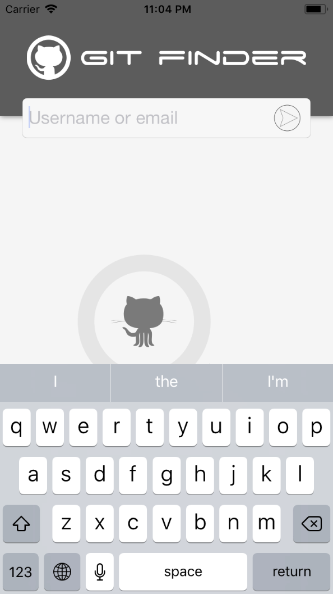
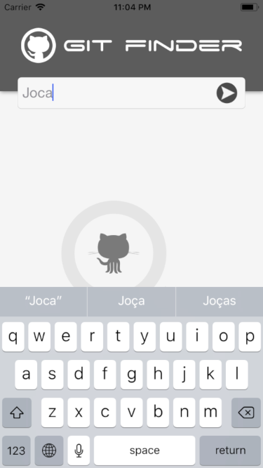
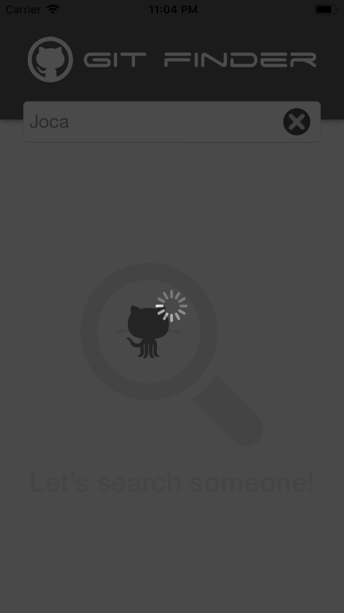
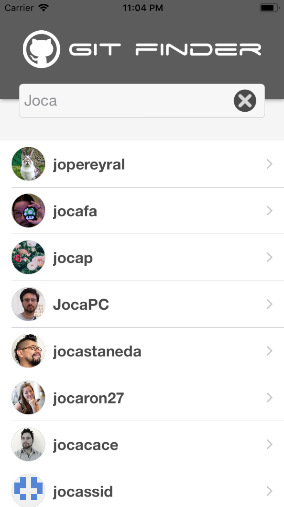
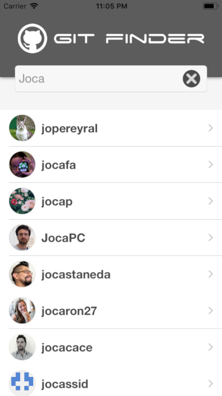

# gitfinder
Reference application of Swift usage for an iOS application where the context is to search the GitHub API to fetch some user.

## Start

Para desenvolver este pequeno aplicativo de demonstração, suas telas foram projetadas antecipadamente ao início do desenvolvimento utilizando a ferramenta "Sketch", cujo seus arquivos podem ser encontrados na pasta "prototype" deste repositório.

Caso não tenha o Sketch (a versão trial) pode abrir os arquivos, ou em último caso, na pasta "screenshots" encontrará as images.

### Requirements

The application was developed using Xcode 9.4.1, and does not use frameworks external to that offered by Swift itself.

### Installation

Clone this repository to a desired location on your Mac:

```
$ git clone git@github.com:jocabrandao/gitfinder.git
```

## What you find here?

 - MVVM Pattern
 - Storyboard
 - Protocol
 - Extensions
 - Autolayout
 - Stack View
 - UIView
 - UILabel
 - UITableView
 - UITableViewCell (customização)
 - UIImage
 - UIImageView
 - UIColor
 - UIViewController
 - UITableViewDelegate
 - UITableViewDataSource
 - Struct
 - Enum
 - @IBDesignable
 - @IBInspectable

## Screenshots








## Tools

* [Xcode 9.4.1](https://developer.apple.com/xcode/) - Development Environment IDE.
* [Sketch 51](https://www.sketchapp.com/) - Prototype Environment Tool.

## Author

* **João Carlos Brandão Morgado**
* [joaobrandao](https://github.com/jocabrandao)
* [LinkedIn](https://www.linkedin.com/in/jcbrandao/)