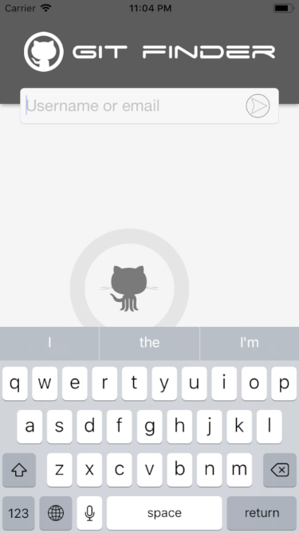

# gitfinder
Reference application of Swift usage for an iOS application where the context is to search the GitHub API to fetch some user.

## Start

In order to develop this small demo application, its screens were designed in advance at the beginning of development using the "Sketch" tool, whose files can be found in the "prototype" folder of this repository.

If you do not have the Sketch (the trial version) you can open the files, or in the latter case, in the "screenshots" folder you will find the images.

### Requirements

The application was developed using Xcode 9.4.1, and does not use frameworks external to that offered by Swift itself.

### Installation

Clone this repository to a desired location on your Mac:

```
$ git clone git@github.com:jocabrandao/gitfinder.git
```

## What you find here?

 - MVVM Pattern
 - Storyboard
 - Protocol
 - Extensions
 - Autolayout
 - Stack View
 - UIView
 - UILabel
 - UITableView
 - UITableViewCell (customização)
 - UIImage
 - UIImageView
 - UIColor
 - UIViewController
 - UITableViewDelegate
 - UITableViewDataSource
 - Struct
 - Enum
 - @IBDesignable
 - @IBInspectable

## Screenshots




## Tools

* [Xcode 9.4.1](https://developer.apple.com/xcode/) - Development Environment IDE.
* [Sketch 51](https://www.sketchapp.com/) - Prototype Environment Tool.

## Author

* **João Carlos Brandão Morgado**
* [GitHub](https://github.com/jocabrandao)
* [LinkedIn](https://www.linkedin.com/in/jcbrandao/)